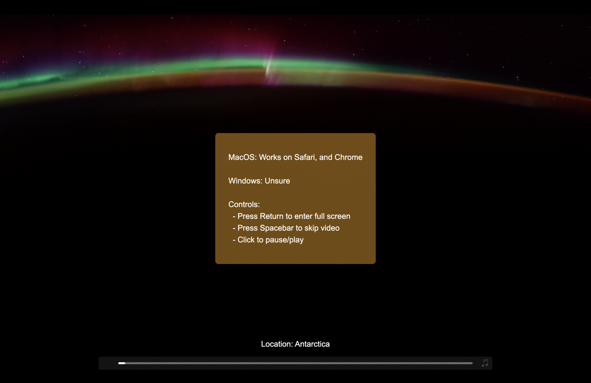

# EarthView: Apple Aerial Web Viewer

This project is a minimalistic video player that randomly plays ultra-high-definition videos of beautiful locations around the Earth, sourced from Apple Aerial screensaver videos. It includes enhanced features like music playback, video progress indicators, and fullscreen toggling.

## What's New (v1.1)
- Added: Video length and time-elapsed indicators.
- Improved: Enhanced design for a more user-friendly experience.
- Optimized: Refined controls for smoother interaction.

## Features

- Randomly plays one of many ultra high definition videos.
- Displays location information for each video.
- NEW: Video length and time-elapsed indicators.
- Allows toggling between play and pause by clicking on the video.
- Supports fullscreen mode (Enter key).
- Plays background music from New South Wales 94.5 FM.
- Simple progress bar to track video progress.
- Custom controls for skipping videos (Spacebar), muting/unmuting music, and more.
- Cursor auto-hides after 2 seconds of inactivity.
- Basic notifications for user guidance.

## Demo

Here’s how the player looks:




## Controls

- **Click**: Play/Pause the video.
- **Spacebar**: Skip to the next video.
- **Enter**: Toggle fullscreen mode.
- **Click on the progress bar**: Seek to the desired point in the video.
- **🎵 Button**: Toggle background music on/off.

## Installation and Usage

1. Clone the repository:
    ```bash
    git clone https://github.com/lekandigital/EarthView.git
    cd EarthView
    ```

2. You can directly open the `index.html` file in any supported web browser to run the app. 

3. Make sure you have an active internet connection, as it streams audio from an external radio station and plays videos from external URLs.

## File Structure

- `index.html`: Main HTML file containing the player structure and layout.
- `styles.css`: Contains the styling for the video player, controls, and notifications.
- `scripts.js`: JavaScript file for controlling video playback, audio, fullscreen, and user interactions.
- `data.js`: Contains the JSON data of videos, including URLs and location details.

## Supported Platforms

- **MacOS**: Works on Safari and Chrome.
- **Windows**: Compatibility is currently not guaranteed.

## Future Enhancements

- Improve compatibility with more browsers and platforms.
- Implement local video caching for offline play.

## Contributing

Feel free to contribute by forking the repository and submitting pull requests. Any improvements and bug fixes are welcome.

## License

This project is licensed under the MIT License. See the [LICENSE](./LICENSE) file for details.

## Acknowledgements

- Video assets are from Apple's aerial screensaver.
- Radio stream from [FBi Radio](https://fbiradio.com/).